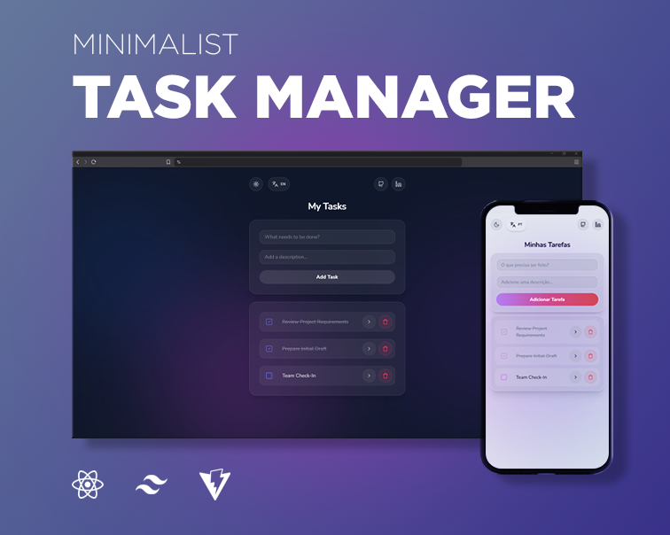

# React Task Manager

A task management application built with **React** and **Tailwind CSS**, featuring Context API, custom hooks, internationalization, and dynamic routing.

**[](https://react-task-manager-sandy-gamma.vercel.app/)**

[](https://react-task-manager-sandy-gamma.vercel.app/)

---

## ⚡ Features

- **Full CRUD Support:** Create, view, edit, and delete tasks.
- **Persistent Storage:** Tasks and user preferences (theme/language) are automatically saved to `localStorage`.
- **Internationalization (i18n):** Full support for **English** & **Portuguese** with automatic browser language detection.
- **Dark & Light Theme Toggle:** A seamless theme toggle that persists across sessions.
- **Dynamic Routing:** Seamless navigation between the main dashboard and detailed task views using React Router.
- **Enhanced Accessibility:** Full keyboard navigation, semantic HTML, skip links, and localized ARIA labels.
- **Fully Responsive:** Optimized for mobile, tablet, and desktop screens.

---

## 🛠️ Tech Stack

| Technology       | Purpose                                         |
| ---------------- | ----------------------------------------------- |
| **React**        | State management, Custom Hooks, and Context API |
| **React Router** | Client-side routing and dynamic URL parameters  |
| **Tailwind CSS** | Utility-first styling and responsive design     |
| **i18next**      | Multi-language translation management           |
| **Lucide React** | Consistent, professional icon library           |
| **Vite**         | Fast build tool and development server          |

---

## 🚀 Getting Started

Follow the steps below to explore the project locally:

### Prerequisites

- [Node.js](https://nodejs.org/) v18 or higher
- [npm](https://www.npmjs.com/) or your preferred package manager

### Installation & Setup

1. **Clone the repository:**

   ```bash
   git clone https://github.com/leonamlvs/react-task-manager.git
   cd react-task-manager
   ```

2. **Install dependencies:**

   ```bash
   npm install
   ```

3. **Start the development server:**

   ```bash
   npm run dev
   ```

The application will be available at `http://localhost:5173`

---

## 🔗 Let's Connect

This project focuses on front-end development as part of my journey into full-stack engineering. If you have any feedback or would like to discuss the implementation details, I'd love to hear from you!

[](https://www.linkedin.com/in/leonamlvs)
[](https://github.com/leonamlvs)

---

## 📄 License

This project is licensed under the MIT License - see the [LICENSE](LICENSE) file for details.
